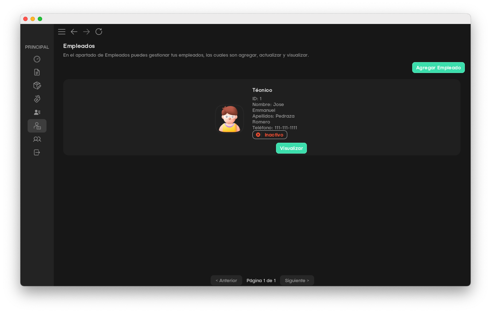
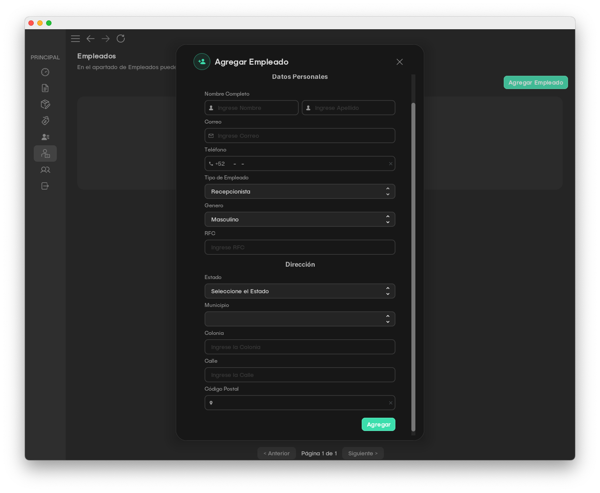
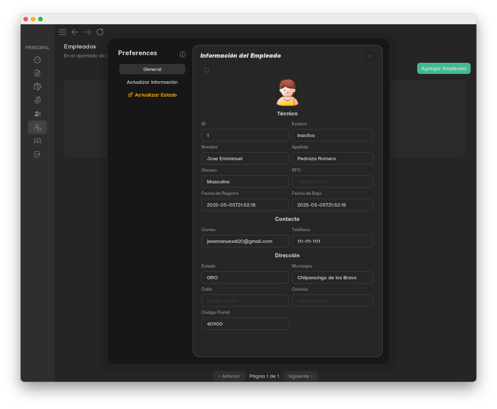
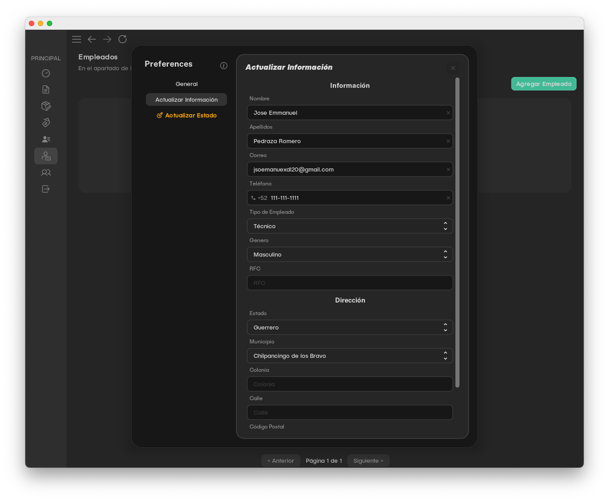
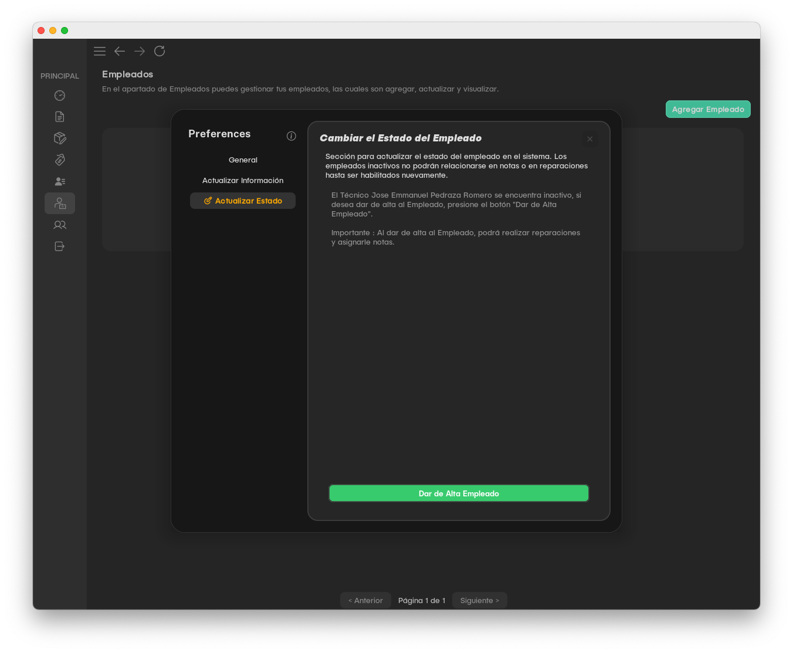

# Taller Celulares - Proyect
Este software fue desarrollado para facilitar la administración de reparaciones en un taller de celulares. Permite la creación, consulta y gestión de notas de servicio, asociando técnicos, fechas, dispositivos y detalles de reparación.

Este softwar se está realizando para la materia de Ingeníria de Software,

## Tecnologías utilizadas

- Java (Swing)
- Intellij IDE
- MySQL
- JDBC
- JPA

## Administración de Empleados

